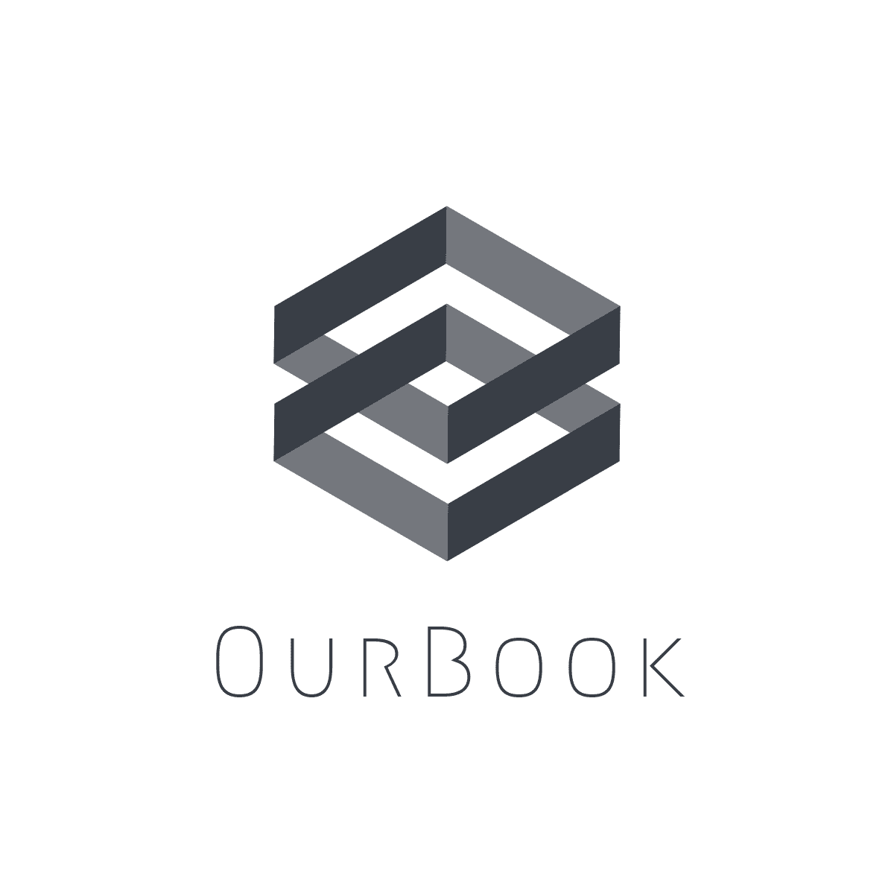

# OurBook
<p align="center">

</p>

## 요약

P2P 전공서적/솔루션 공유 플랫폼

## 문제의식 

서울시 전공서적 구매를 위해 소비되는 대학생들의 경제적 지출은 880억에 이르며,   
이렇게 구매된 전공서적은 학기가 종료되면 대부분 방치되고 버려진다.

서울시의 대학생 전공 서적의 구매 규모를 예측해 본다면, 

```
370,000명 (서울시 내 1학년 제외한 재학 대학생 수)
X 40,000원 X 3권 X 2학기 
= 
(연간) 88,800,000,000 원 
```

을 전공서적에 사용하는 데에 들이는 셈이다. 


## 중고거래가 아닌 '공유'플랫폼 필요한 이유

### 중고거래로 전공서적은 많이 쓰이지 않는다

중고 전공서적을 통해 책값의 부담을 줄일 수는 있으나,   
거래에 대한 접근성 부족으로 중고 전공서적 거래가 원활히 일어나고 있지 않다

### 가격은 높지만, 종류는 적다
 
한 학기만 사용하고 방치되는 고가의 전공서적 (학기 말) 

### 반드시 사야만 한다

매 학기초 필수적으로 새로 구매해야 하는 전공서적이 존재하나, 
한 학기가 지나가면 잔존가치 급감한다